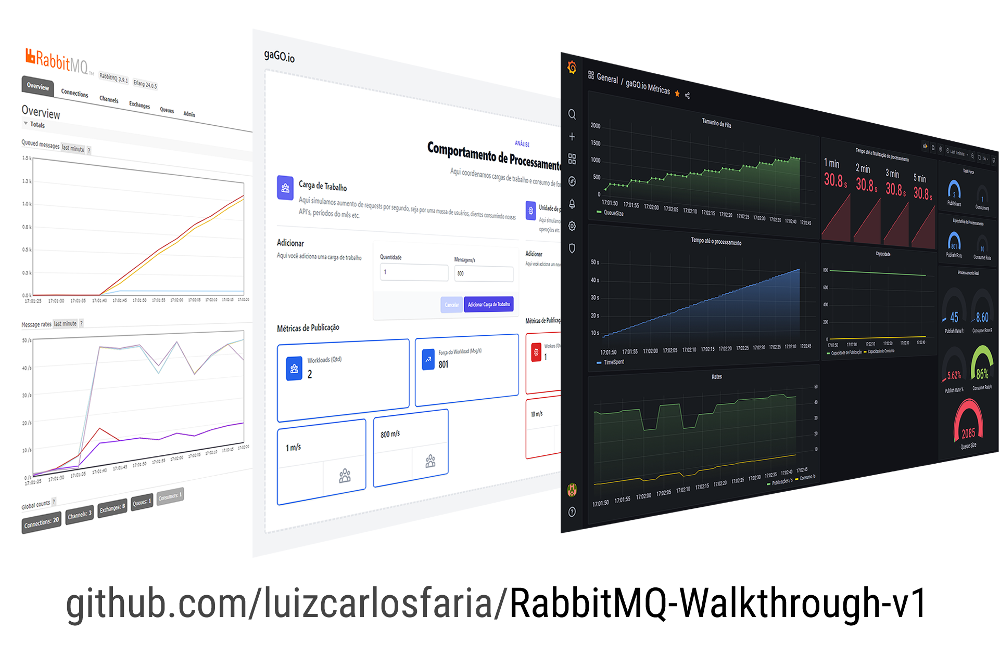

# RabbitMQ-Walkthrough

RabbitMQ - Demonstração de Comportamento padrão com Mensageria.

**Material complementar dos cursos:**

 - [RabbitMQ para Aplicações .NET](https://lp.gago.io/rabbitmq) 
 - [Docker Definitivo / O ROADMAP](http://dockerdefinitivo.com/)
  
## Objetivo

1) Demonstrar comportamento padrão quando:
A) Temos uma carga de trabalho menor que nossa capacidade de processamento
B) Temos uma carga de trabalho igual à nossa capacidade de processamento 
B) Temos uma carga de trabalho maior que nossa capacidade de processamento 

2) Nesses casos:
A) Como as filas acumulam mensagens?
B) Como o tempo médio até o processamento é influenciado?
C) Como lidamos com escala?

3) Nesse exemplo conseguimos demonstrar:
A) Disponibilidade
B) Eficiência
C) Resiliência
D) Confiabilidade
C) Escalabilidade
E) Idempotência e porque precisamos dela, quando ela faz mais sentido em cenários assíncronos.

## Decisões técnicas

Todas as decisões técnicas forma tomadas com base nos objetivos da aplicação. 
Tirar de contexto pode e provavelmente fará  fazer com que você falhe.
Copiar código para colocar em produção pode te custar muito caro, pois as decisões tomadas aqui tem função didática.

## Sobre a discrepância entre Throughput solicitado vs Throughput real

As métricas de throughput foram criadas quando publisher e consumer não realizavam nenhuma tarefa que não fosse a iteração com o RabbitMQ. Dessa forma, como eles operavam em média em menos de 1 ms a até 3 ms, então era possível desprezar o tempo de processamento por mensagem.
Com a adição do Banco de Dados, temos uma degradação variável que depende de:

 - Volume de mensagens no banco.
 - Quantidade de operações escritas simultâneas
 - Quantidade de operações leituras simultâneas

Dessa forma é quase impossível criar algo preciso sem implementar um algoritmo adaptativo. 
Na fase em que não tínhamos acesso a banco, tentei usar o [RateLimiter](https://github.com/David-Desmaisons/RateLimiter), mas a discrepância entre o algoritmo de waiting que usávamos, versos a implementação de RateLimiter fez com que abandonássemos essa ideia naquela época. Tem um branch com essa implementação aqui no projeto. Mas ele data de uma outra versão. Talvez faça sentido voltar nele agora.

## Sobre
Para maiores informações visite http://gago.io/
Mais informações sobre RabbitMQ http://gago.io/rabbitmq

## Como usar

### GIT Clone

Esse repositório está distribuído em diverso locais. Cada um com uma finalidade e evoluindo em direção independente.

#### Alunos RabbitMQ para Aplicações .NET

https://github.com/luizcarlosfaria-rabbitmq-masterclass/RabbitMQ-Walkthrough.git

Nosso foco aqui é entender RabbitMQ e seu uso.

#### Alunos Docker Definitivo / O Roadmap

https://github.com/docker-definitivo/RabbitMQ-Walkthrough.git

Nosso objetivo é entender RabbitMQ, entender algumas decisões arquiteturais e o motivo de algumas escolhas.

Do ponto de vista de docker, podemos ver como conseguimos montar stacks completas prontas para demonstração.

Do ponto de vista de arquitetura, conseguimos ver cenários onde usamos tecnologias especialistas para cada finalidade. Como o grafana para Visualização dos dados, enquanto usamos o RabbitMQ para mensageria e o SQL Server para persistência definitiva.

#### Comunidade 

Uso geral de acordo com a licença.

- https://github.com/luizcarlosfaria/RabbitMQ-Walkthrough.git

### O stack conta com quais componentes?

- Web APP 
    - .NET 5
    - Web
    - AngularJS
    - CSS: [tailwindcss](https://tailwindcss.com/)
    - API's não autenticadas

- SQL Server
    - Imagem customizada luizcarlosfaria/mssql-server-linux:2019-latest ([saiba mais](https://gago.io/blog/projetos/mssql-server-linux/))
    - Automação padrão da imagem para criação de banco e usuários
    - Automação padrão da imagem para criação dos objetos de banco (tabelas)

- RabbitMQ 
    - Imagem: rabbitmq:3.9.1-management-alpine
    - Single Node
    - Com ar

- Grafana
    - Imagem: grafana/grafana:8.0.5-ubuntu
    - Single Node
    - Pré configurado
      -  Habilitando métricas por objeto no prometheus
      -  Habilitando coleta de métricas a cada 1 segundo (antipattern para produção)
      -  Habilitnado modo de coleta de métricas detalhado  (antipattern para produção)
      -  Definição de usuário e virtual host defaults.

Como usar:

     git clone {repourl}
     cd ./RabbitMQ-Walkthrough
     docker-compose pull
     docker-compose build
     docker-compose up
     
Execute no browser:
   
     Aplicação web:
     http://localhost:8877/
     
     Grafana:
     http://localhost:3000/d/mnwDaxWnz/gago-io-metricas?orgId=1&refresh=5s
     
     RabbitMQ
     http://localhost:15672/
